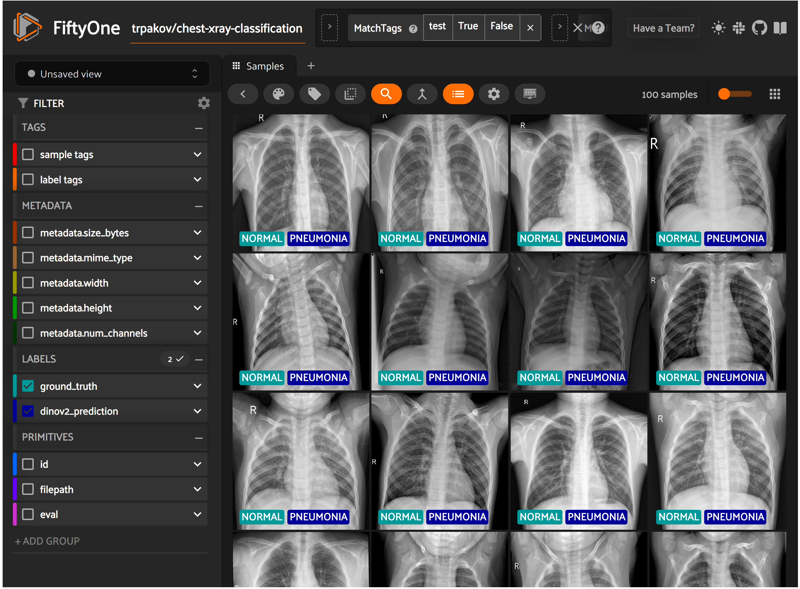

## Link to Jupyter Notebook

*You can access the tutorial as a Jupyter Notebook on [notebooks](https://github.com/sefaburakokcu/notebooks/blob/main/fiftyone_finutene_dinov2_with_huggingface_for_chestxray.ipynb).*

## Introduction

In this tutorial, we will:

* Examine the ChestXray dataset using FiftyOne,
* Finetune a Dinov2 model from HuggingFace Transformers on the ChestXray dataset, which has 2 classes,
* Evaluate the finetuned model on the validation subset,
* Compare predictions and ground truths using FiftyOne.

Let's start by installing the required libraries.

## Setup

Firstly, install HuggingFace datasets, transformers and FiftyOne.


```python
# !pip install datasets transformers --upgrade
```


```python
# !pip install fiftyone 
```

## Dataset

Now, let's download the dataset.


```python
import os
import tqdm
import fiftyone as fo

from datasets import load_dataset

dataset_root = "./datasets"
dataset_splits = ["train", "validation", "test"]

dataset_name = "trpakov/chest-xray-classification"

dataset = load_dataset(dataset_name, name="full")

class_names = dataset["train"].features["labels"].names
labels = class_names

id2label = {id: str(label) for id, label in enumerate(labels)}
label2id = {str(label): id for id, label in enumerate(labels)}

print(f"id2label: {id2label}")

for dataset_split in dataset_splits:
    dataset_save_folder = os.path.join(dataset_root, dataset_split)
    if not os.path.exists(dataset_save_folder):
        os.makedirs(dataset_save_folder)
        
        for image_idx, image_cl_dict in tqdm.tqdm(enumerate(dataset[dataset_split]),
                                                  total=len(dataset[dataset_split]),
                                                  desc=f"Saving {dataset_split} images"):
            image = image_cl_dict["image"]
            cls = id2label[int(image_cl_dict["labels"])]
            
            cls_folder = os.path.join(dataset_save_folder, cls)
            if not os.path.exists(cls_folder):
                os.makedirs(cls_folder)
                
            image.save(f"{cls_folder}/image_{image_idx}.jpg")

print(dataset)
```

    id2label: {0: 'PNEUMONIA', 1: 'NORMAL'}
    DatasetDict({
        train: Dataset({
            features: ['image_file_path', 'image', 'labels'],
            num_rows: 12230
        })
        validation: Dataset({
            features: ['image_file_path', 'image', 'labels'],
            num_rows: 1165
        })
        test: Dataset({
            features: ['image_file_path', 'image', 'labels'],
            num_rows: 582
        })
    })


Now, visualize the first sample of ChestXray dataset.


```python
example = dataset["train"][0]

print(f"label: {example['labels']}")
example["image"]
```

    label: 1

    

    


FiftyOne is an open-source toolkit for visualizing and curating datasets. In this stage, we will visualize all samples from the ChestXray dataset on the FiftyOne web UI.


```python
try:
    fo.delete_dataset(dataset_name)
except:
    pass
fiftyone_dataset = fo.Dataset(dataset_name)

dataset_type = fo.types.ImageClassificationDirectoryTree

for dataset_split in dataset_splits:
    dataset_dir = os.path.join(dataset_root, dataset_split)
    fiftyone_dataset.add_dir(
        dataset_dir=dataset_dir,
        dataset_type=dataset_type,
        tags=dataset_split,
    )
```

     100% |█████████████| 12230/12230 [3.8s elapsed, 0s remaining, 3.4K samples/s]      
     100% |███████████████| 1165/1165 [335.1ms elapsed, 0s remaining, 3.5K samples/s]      
     100% |█████████████████| 582/582 [179.4ms elapsed, 0s remaining, 3.2K samples/s]     


```python
session = fo.launch_app(fiftyone_dataset)
```

Now, we will define and load the preprocessor and the model. Here, we will utilize the Dinov2-base model from Meta.


```python
import torch

from transformers import AutoImageProcessor, AutoModelForImageClassification
from datasets import load_dataset

model_name = "facebook/dinov2-base"
processor = AutoImageProcessor.from_pretrained(model_name)

print(processor)
```

    BitImageProcessor {
      "crop_size": {
        "height": 224,
        "width": 224
      },
      "do_center_crop": true,
      "do_convert_rgb": true,
      "do_normalize": true,
      "do_rescale": true,
      "do_resize": true,
      "image_mean": [
        0.485,
        0.456,
        0.406
      ],
      "image_processor_type": "BitImageProcessor",
      "image_std": [
        0.229,
        0.224,
        0.225
      ],
      "resample": 3,
      "rescale_factor": 0.00392156862745098,
      "size": {
        "shortest_edge": 256
      }
    }
    


```python
model = AutoModelForImageClassification.from_pretrained(
    model_name,
    num_labels=len(labels),
    id2label=id2label,
    label2id=label2id
)
```

To obtain a robust model, we will apply some augmentations to the training dataset. 


```python
from torchvision.transforms import Compose, RandomResizedCrop, RandomHorizontalFlip, ColorJitter, ToTensor, Normalize
import torch

# Extarct image mean, std and interpolation from the inference processor
mean = processor.image_mean
std = processor.image_std
interpolation = processor.resample

train_transform = Compose([
    RandomResizedCrop(size=(224, 224), scale=(0.08, 1.0), ratio=(0.75, 1.3333), interpolation=interpolation),
    RandomHorizontalFlip(p=0.5),
    ColorJitter(brightness=(0.6, 1.4), contrast=(0.6, 1.4), saturation=(0.6, 1.4)),
    ToTensor(),
    Normalize(mean=mean, std=std),
])
```


```python
def prepare_data(batch, mode="train"):
  images = batch["image"]

  if mode == "train":
    images = [train_transform(image.convert("RGB")) for image in images]
    pixel_values = torch.stack(images)
  elif mode == "test":
    pixel_values = processor(images, return_tensors="pt").pixel_values
  else:
    raise ValueError(f"Mode {mode} not supported")

  inputs = {}
  inputs["pixel_values"] = pixel_values
  inputs["labels"] = torch.tensor(batch["labels"])

  return inputs

# set num_proc equal to the number of CPU cores on your machine
train_dataset = dataset["train"].map(prepare_data, num_proc=1, batched=True, batch_size=20, fn_kwargs={"mode":"train"})
eval_dataset = dataset["test"].map(prepare_data, num_proc=1, batched=True, batch_size=20, fn_kwargs={"mode":"test"})
```

Make the dataset suitable for Pytorch.


```python
train_dataset.set_format("torch")
eval_dataset.set_format("torch")
```

Here, collate_fn is used for batching examples.


```python
import torch

def collate_fn(examples):
    pixel_values = torch.stack([example["pixel_values"] for example in examples])
    labels = torch.tensor([example["labels"] for example in examples])
    return {"pixel_values": pixel_values, "labels": labels}
```

## Training the Model

In this stage, we will define training arguments and evaluation metrics.


```python
from transformers import TrainingArguments

training_args = TrainingArguments(
    output_dir=f"{model_name}",
    per_device_train_batch_size=32,
    evaluation_strategy="steps",
    num_train_epochs=4,
    fp16=True,
    save_steps=100,
    eval_steps=100,
    logging_steps=100,
    learning_rate=5e-5,
    save_total_limit=2,
    remove_unused_columns=False,
    push_to_hub=False,
    report_to='tensorboard',
    load_best_model_at_end=True,
    metric_for_best_model="accuracy",
)
```


```python
from sklearn.metrics import accuracy_score
import numpy as np

def compute_metrics(eval_pred):
    """Computes accuracy on a batch of predictions"""
    predictions = np.argmax(eval_pred.predictions, axis=1)
    accuracy = accuracy_score(y_pred=predictions, y_true=eval_pred.label_ids)
    return {"accuracy": accuracy}
```


```python
from transformers import Trainer

trainer = Trainer(
    model,
    training_args,
    train_dataset=train_dataset,
    eval_dataset=eval_dataset,
    tokenizer=processor,
    compute_metrics=compute_metrics,
    data_collator=collate_fn
)
```

Now, we are ready to start finetuning our model.


```python
train_results = trainer.train()

trainer.save_model()
trainer.log_metrics("train", train_results.metrics)
trainer.save_metrics("train", train_results.metrics)
trainer.save_state()
```

    ***** train metrics *****
      epoch                    =          4.0
      total_flos               = 3562792493GF
      train_loss               =       0.2489
      train_runtime            =   0:22:04.82
      train_samples_per_second =       36.926
      train_steps_per_second   =        1.156


## Evaluate the Finetuned Model

After training, evaluate the finetuned model.


```python
metrics = trainer.evaluate()

trainer.log_metrics("eval", metrics)
trainer.save_metrics("eval", metrics)
```

    ***** eval metrics *****
      epoch                   =        4.0
      eval_accuracy           =     0.8282
      eval_loss               =     0.4037
      eval_runtime            = 0:00:09.98
      eval_samples_per_second =     58.267
      eval_steps_per_second   =      7.308


```python
from transformers import AutoModelForImageClassification, AutoImageProcessor

finetuned_model_folder = "./facebook/dinov2-base"

image_processor = AutoImageProcessor.from_pretrained(finetuned_model_folder)
model = AutoModelForImageClassification.from_pretrained(finetuned_model_folder)
```


```python
from PIL import Image
import torch

def infer(image):
    # prepare image for the model
    encoding = image_processor(image.convert("RGB"), return_tensors="pt")
    
    # forward pass
    with torch.no_grad():
        outputs = model(**encoding)
        logits = outputs.logits
        predicted_class_idx = logits.argmax(-1).item()
        predicted_class = id2label[predicted_class_idx]
        return predicted_class
```


```python
fiftyone_test_dataset = fiftyone_dataset.match_tags("test")
for sample in fiftyone_test_dataset.iter_samples(autosave=True, progress=True):
    image_path = sample.filepath
    image = Image.open(image_path)
    predicted_class = infer(image)
    sample["dinov2_prediction"] = fo.Classification(label=predicted_class)
```

     100% |█████████████████| 582/582 [1.3m elapsed, 0s remaining, 7.3 samples/s]      


```python
session.view = fiftyone_test_dataset
```


```python
results = fiftyone_test_dataset.evaluate_classifications(
    "dinov2_prediction",
    gt_field="ground_truth",
    eval_key="eval",
    method="binary",
    classes=labels,
)
```


```python
results.print_report()
```

                  precision    recall  f1-score   support
    
       PNEUMONIA       0.85      0.92      0.88       411
          NORMAL       0.76      0.61      0.68       171
    
        accuracy                           0.83       582
       macro avg       0.80      0.77      0.78       582
    weighted avg       0.82      0.83      0.82       582
    


```python
plot = results.plot_confusion_matrix()
plot.show()
```

```python
plot = results.plot_pr_curve()
plot.show()
```


```python
print(fiftyone_test_dataset.count_values("eval"))
```

    {'TP': 105, 'TN': 377, 'FP': 34, 'FN': 66}


```python
from fiftyone import ViewField as F

session.view = (
    fiftyone_test_dataset
    .match(F("dinov2_prediction.label") != F("ground_truth.label"))
)
```

```python
session.freeze()
```
